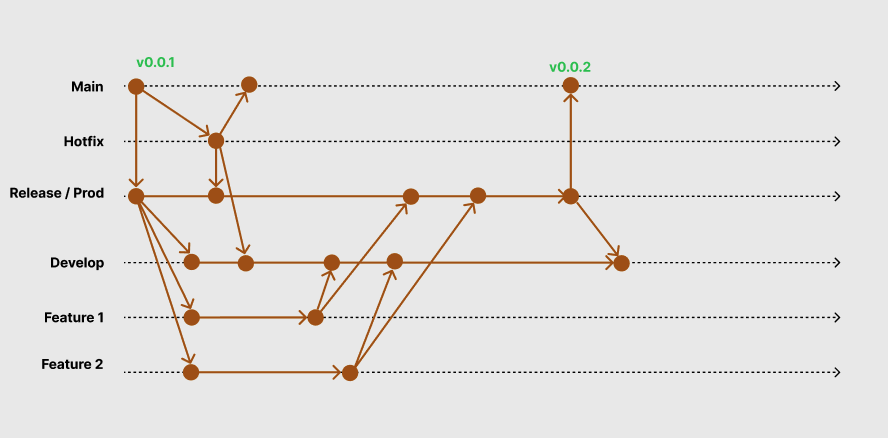

# Github CI release template 1


## Install

```
npm install
```

## Release

```
npm run release
```

## Write Changelog

```
npx changeloggithub@latest --output ./CHANGELOG-v1.0.3.md
```

## FLow




## Convention commit
[Convention](https://www.conventionalcommits.org/en/v1.0.0/#examples)

```md
- build: build system or external dependencies

- ci: Continuous integration configuration files and scripts

- chore: Documentation only changes

- docs: Documentation only changes

- feat: A new feature

- fix: A bug fix

- perf: A code change that improves performance

- refactor: A code change that neither fixes a bug nor adds a feature

- revert: Reverts a previous commit

- style: Changes that do not affect the meaning of the code (white-space, formatting, missing semi-colons, etc)

- test: Adding missing tests or correcting existing tests

- dx: Developer Experience

- types: Typescript related changes

- wip: Work in progress

- workflow: Changes to the build process or auxiliary tools and libraries such as documentation generation

- !: flag breaking news
```

## Exmaple

```
git commit -m "feat: add new feature"

git commit -m "fix!: hot fix production"
```
